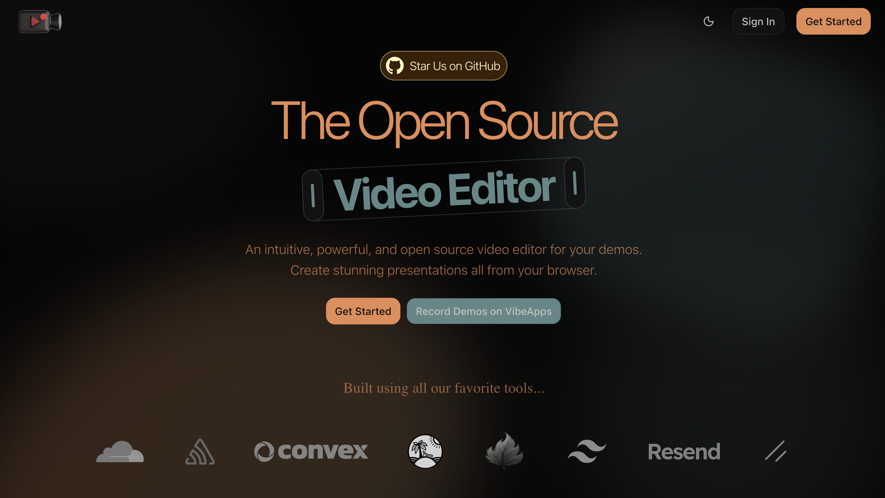
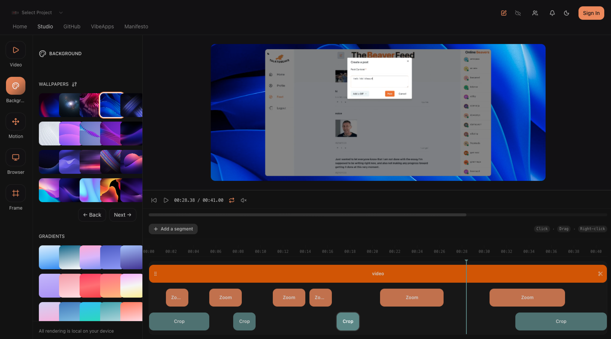

# [RecordDemos](https://recorddemos.com)




An intuitive, powerful, and open source video editor for your demos. Create stunning presentations all from your browser.

## Prerequisites

Before you begin, ensure you have accounts and API keys for the following services:

- [Clerk](https://clerk.com) - Authentication
- [Convex](https://convex.dev) - Backend and database
- [Autumn](https://useautumn.com) - Payment and subscription management
- [Cloudflare R2](https://www.cloudflare.com/products/r2/) - File storage (@convex/r2)
- [Sentry](https://sentry.io) - Error monitoring and feedback

## Getting Started

1. Install dependencies:

```bash
pnpm install
```

2. Set up your environment variables. Create a `.env.local` file with:

```bash
VITE_CLERK_PUBLISHABLE_KEY=your_clerk_key
VITE_CONVEX_URL=your_convex_url
CLERK_JWT_ISSUER_DOMAIN=your_clerk_domain
AUTUMN_SECRET_KEY=your_autumn_key
```

3. Start the development server:

```bash
pnpm dev
```

```bash
pnpx convex dev
```

4. Open [http://localhost:3000](http://localhost:3000) in your browser to view the app.

## Linting & Formatting

This project uses [Biome](https://biomejs.dev/) for formatting:

```bash
pnpm lint
pnpm format
pnpm check
```

## Tech Stack

- [TanStack Router](https://tanstack.com/router) - File-based routing
- [TanStack Start](https://tanstack.com/start) - Full-stack React framework
- [TanStack Query](https://tanstack.com/query) - Data fetching
- [Tailwind CSS](https://tailwindcss.com) - Styling
- [Shadcn UI](https://ui.shadcn.com) - UI components
- [Radix UI](https://www.radix-ui.com) - Accessible component primitives

## Learn More

- [TanStack Documentation](https://tanstack.com)
- [Convex Documentation](https://docs.convex.dev)
- [Clerk Documentation](https://clerk.com/docs)
